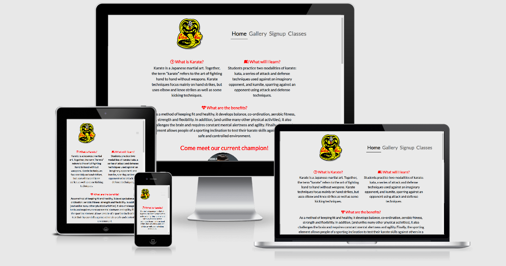

# Cobra Kai

 This project was designed to allow younger age groups to learn more about karate and hopefully sign up to lessons. This website will allow users to read about karate, Cobra Kai in particular, look at the gallery, see timetables for lessons and to sign up for classes if they wish.
As the developer I designed this project after watching the new Netflix TV series, Cobra Kai. I would like for younger kids to have a platform to learn more about Cobra Kai, view photos and hopefully come to learn!

# Contents

* UX (User experience)
    * User Goals
    * User Requirements and Expectations
* Wireframes
* Features
    * Features that have been developed
    * Features that will be implemented in the future
* Technologies Used
* Bugs discovered
* Testing
* Deployment
* Credits
* Awknowledgements

# Development
 To get set up for developing :
1. Clone the repository `git clone https://github.com/ShannonD7833/CobraKai.git`
2. Change into project directory `cd CobraKai`
3. Run the server 
   * VS code
      * Install [live server extension](https://marketplace.visualstudio.com/items?itemName=ritwickdey.LiveServer)
      * Go to "View > Command Palette" and type "Live server" and select "Open with live server"
   * Python HTTP server
      * Python 2 `python -m SimpleHTTPServer 5500`
      * Python 3 `python3 -m http.server 5500`
4. Open http://localhost:5500 

# UX
The target audience for this project is aimed at teenagers. It will also include parents of these children who wish to sign up for karate.

As a new customer:
1. I want to read information on the type of karate learnt as this company
2. I want to see photographs to give me an idea of what to expect within the premises
3. I want to be able to see a timetable with classes and times.
4. I want a form which is easy to use where i can sign up for lessons
5. I want to be able to return to the homepage quickly and easily
6. I need to have a contact telephone number and address
7. I want to visit the social media pages for various different platforms

As a returning customer I want:
1. To see the times and dates of upcoming classes
2. Updated photographs from recent classes and competitions
3. To have a contact telephone number

As a parent of customers I need:
1. To know the instructors are qualified and trustworthy
2. The premises are safe to carry out karate classes
3. To see the timetable of my childrens classes
4. To have an address and contact number 

As a developer I want:
1. Customers to be able to navigate through the website easily and quickly
2. Customers to feel comfortable enough to signup to karate after visiting the website
3. Consistency throughout all pages
4. A collage of photos in a gallery which encourage customers to sign up
5. A Navigation bar which will be simple for customers to follow and become responsive depending on the device its being viewed on.

This project will provide all users with 4 pages including a home page packed with information, a gallery page, timetable and a signup form.

# Wireframes

I used [Balsamiq](https://balsamiq.com/wireframes/?gclid=CjwKCAiA9bmABhBbEiwASb35VwUP86nusbRkDn2_oK45Wc06sE-LKld8DUd5znTuQObwilsvALXI5RoCda0QAvD_BwE) for my project wireframes.

Below is a link to my wireframes for all three pages of my website. 

[Wireframes can be viewed here.](https://github.com/ShannonD7833/CobraKai/blob/master/assets/wireframes/cobrakaiwireframes.pdf)

When building my web page I did make some changes which now differ to my wireframes. Using dev tools showed me better ways to present my project and so the final project may be different to the original wireframes designed. I was not going to use bootstrap initially but then became confident in using it so the layout of a few things changed in my final project from my wireframes.

My final design was slightly altered due to various factors but I am happier with the outcome.

# Features
* Logo of the company which when clicked will return the user to the homepage
* User will always know which page they are on since it will be underlined in the navigation bar
* Navigation bar which when hovered over will underline each page
* Social media icons which when clicked will take the user to a new page and open up the social media page
* Consistent header and footers along each page of the webpage
* Photos and descriptions of instructors and current champion
* Interactive map with address and contact telephone number
* Gallery images
* Form with clear instructions on how to sign up
* Timetable which has times of classes

## Features left to implement
* I would like to add videos in the future

# Technologies Used
* I used [HTML5](https://developer.mozilla.org/en-US/docs/Web/HTML) and [CSS](https://developer.mozilla.org/en-US/docs/Web/CSS) languages for writing the code in this project.

* [Google Fonts](https://fonts.google.com) was used to style the font within my project. Lato font was used for the text.
* [Font awesome icons](https://fontawesome.com/icons?d=gallery) were used to add icons to the social media links in the footer.
* [Google maps](https://www.maps.ie/create-google-map/) was used for the iframe for the address map.
* [Bootstrap](https://getbootstrap.com/) was used to make my website more responsive using layouts and tables to assist with my styling.

# Bugs Discovered

* ## Index.html
    * Images were square so I changed this to make it more visually appealing using chrome dev tools. [Without border radius](assets/images/border-radius.png) and then I added a border radius of 50% which can be seen [here](assets/images/border-radius-after.png).

    * The margin between the social media links were too close together so using dev tools I played around with the padding size and found one that worked [here](assets/images/social-media-icons-after.png).

    * I used bootstrap to align my images in a much more user friendly way. I then checked this using dev tools to ensure the design was consistent at my breakpoints which worked out much better [here](assets/images/bootstrap-images.png).

* ## Signup.html

    * My submit button would not align into the center. I used dev tools to see if I could align it but I then had to align my parent DIV centrally and the button afterwards [aligned](assets/images/submitbutton.png).

   * Table layout from bootstrap did not work correctly when then scaled down to my mobile breakpoint.
   I changed the layout of the timetable so it was more visually appealing and especially when viewed on mobile devices.

   * The [table](assets/images/tablemobileview.png) before changes were made. [Updated](assets/images/newtableviewmobile.png) table is easier to view on mobile devices. 

   * My navbar did not work across a few breakpoints so I added a Bootstrap navbar to ensure at each breakpoint the navbar is responsive. The new navbar can be seen [here](assets/images/navbar.png) where it becomes a dropdown navbar which is much more user friendly for smaller devices.

   * General bugs throughout my pages were layout issues on different devices and I fixed these by using margins and paddings which can be seen in my CSS. 

   * When viewing my website on my own mobile, layout on the index.html page did not look right, there was padding around the second paragraph tag. I took this out to make the page more consistent on small devices [here](assets/images/mobileviewmargin.png).

   * Instructor paragraphs viewed on my mobile looked too big, I changed the font size and it worked much better from 20px to 13px [here](assets/images/fontsizemobile.png).

# Testing
* I tested my media queries and responsive design using the dev tools on chrome, as you can see the tablet view [here](assets/images/1024.png) for the index page, gallery page [here](assets/images/1024gallery.png), signup page [here](assets/images/1024signup.png) and finally the classes page [here](assets/images/1024classes.png).

* The same testing was done using the mobile view for the [index](assets/images/670index.png), [gallery](assets/images/670gallery.png), [signup](assets/images/670signup.png) and the [classes](assets/images/670classes.png).

* I tested my media queries for the mobile view using dev tools which can be seen [here](assets/images/media-query-mobile-index.png)

* I had to make sure the navigation bar links were interactive and when clicked brought me to a different page and this can be shown [here](assets/images/test-navbar.png). The link under the navigation link became underlined and when clicked brought me to a the gallery page.

* When testing the social media icons, I clicked on them and they opened up the corresponding social media platform on a new page which is what I expected to happen so I knew that they worked.

* I tested my HTML using the validator and initially there was an issue with a child element. [This](assets/images/htmlvalidator.png) was fixed as I had put the li and ul element in the wrong way and when this was fixed the issue was resolved. The HTML passed the [validator](assets/images/htmlvalidatorpass.png). I tested each page of my website in the HTML validator. The [gallery](assets/images/galleryhtmlvalidator.png) , [signup](assets/images/signuphtmlvalidator.png) , [timetable](assets/images/timetablehtmlvalidator.png) can be seen.

* My [CSS](assets/images/CSSvalidator.png) passed all the tests using the [Jigsaw validator](https://jigsaw.w3.org/css-validator/validator).

# Testing UX 

I have checked off each of my user stories to ensure I have made my website suitable for all users needs and wants.

As a new customer:
1. I want to read information on the type of karate learnt as this company 
   * [Index page has information on what karate is, what is expected and the benefits](assets/images/UX1.png) 
2. I want to see photographs to give me an idea of what to expect within the premises
   * [Gallery page contains a collage of up to date images](assets/images/UX2.png)
3. I want to be able to see a timetable with classes and times.
   * [Classes page has a timetable with days/times/type of class](assets/images/UX3.png)
4. I want a form which is easy to use where i can sign up for lessons
   * [Sign up page contains a form to enquire about signing up](assets/images/UX4.png)
5. I want to be able to return to the homepage quickly and easily
   * [Nav bar across all pages contains a logo which when clicked links back to the homepage](assets/images/UX5.png)
6. I need to have a contact telephone number and address
   * [Home page contains contact information including map with an address](assets/images/UX6.png)
7. I want to visit the social media pages for various different platforms
   * [Footer of each page contains an icon which when clicked links to the corresponding social media page](assets/images/UX7.png). The corresponding social media page will open in a new [page](assets/images/UX8.png)

As a returning customer I want:
1. To see the times and dates of upcoming classes
   * [Classes page has a timetable with days/times/type of class](assets/images/UX3.png)
2. Updated photographs from recent classes and competitions
   * [Gallery page contains a collage of up to date images](assets/images/UX2.png)
3. To have a contact telephone number
   * [Home page contains contact information including map with address](assets/images/UX6.png)

As a parent of customers I need:
1. To know the instructors are qualified and trustworthy
   * [Home page has information on instructors with images](assets/images/UX9.png)
2. The premises are safe to carry out karate classes
   * [Gallery contains images showing inside the dojo with equipment](assets/images/UX2.png)
3. To see the timetable of my childrens classes
   * [Classes page has a timetable with days/times/type of class](assets/images/UX3.png)
4. To have an address and contact number
   * [Home page contains contact information including map with address](assets/images/UX6.png)

I am happy that I have met all the wants and needs of different users who will avail of my webpage. I have also met my own goals as a developer.  

# Deployment
## GitHub Pages
Pushing a new commit to the `master` branch triggers a new deployment to github pages.

Website available on https://shannond7833.github.io/CobraKai/

### Set up deployment to Github pages

1. Log in to GitHub and locate the Repository
2. At the top of the Repository (not top of page), locate the "Settings" Button on the menu.
3. Scroll down the Settings page until you locate the "GitHub Pages" Section.
4. Under "Source", click the dropdown called "None", choose the Branch `master` and choose `/(root)` as the folder to serve the static website from.
5. The page will automatically refresh.
6. Scroll back down through the page to locate the now published site link in the "GitHub Pages" section.

# Credits

Credit for text used on this website 
* https://punchermedia.com/what-is-karate/
* https://en.wikipedia.org/wiki/John_Kreese-

Credit for images used 
* www.google.com
* https://pixlr.com/e/#editor

## Acknowledgement

* I received inspiration for this project from the TV series, Cobra Kai on [Netflix](www.netflix.com).

* Special thanks to [Christopher Temple](https://github.com/christemple) for his support and knowledge and the tutors at [Code Institute](https://codeinstitute.net/) for helping me with issues!

